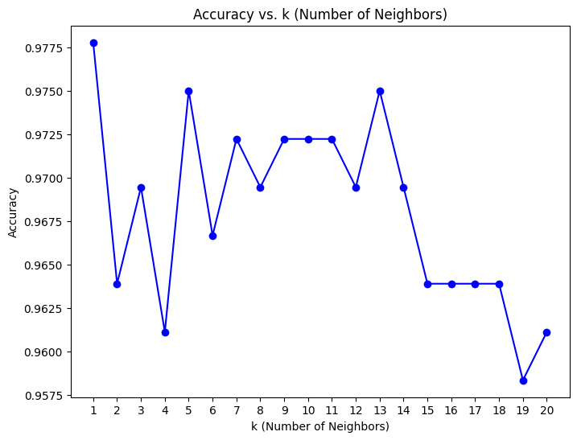
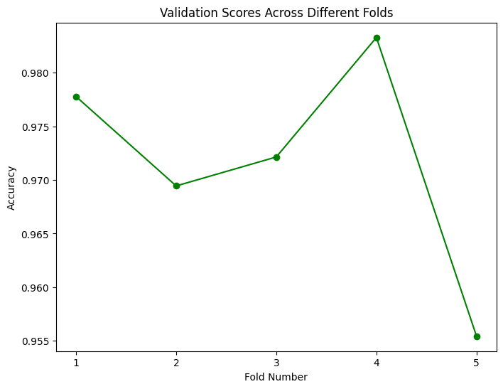
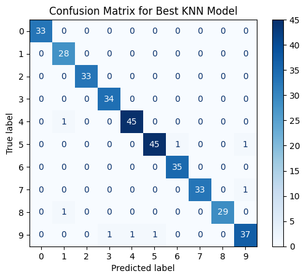

# 🧠 Handwritten Digit Classification with Explainable AI (XAI) Using KNN

This project focuses on classifying handwritten digits using machine learning models, with a special emphasis on interpretability through **Explainable AI (XAI)**. Two models were explored — **K-Nearest Neighbors (KNN)** and **Logistic Regression** — trained on the classic `digits` dataset from `sklearn.datasets`.

## 📦 Dataset

We use the `digits` dataset available in `scikit-learn`, which contains 1,797 8x8 grayscale images of handwritten digits (0–9).

- Each image is represented by 64 pixel values (features).
- The goal is to classify each image into its corresponding digit label.

## 📊 Models Used

1. **K-Nearest Neighbors (KNN)**

   - Simplicity-focused, non-parametric classifier.
   - Tuned for optimal performance using cross-validation.

2. **Logistic Regression**
   - A linear model for classification.
   - Regularization and scaling applied for performance tuning.

## 🧰 Explainable AI (XAI) Analysis

To understand **which pixels (features)** influence each model’s decisions, we employed **Permutation Feature Importance** using `sklearn.inspection.permutation_importance`.

### 🔍 KNN Feature Importance

KNN tends to focus heavily on a small number of **central pixels**, which mirrors human intuition when recognizing digits.

### 🔍 Logistic Regression Feature Importance

Logistic Regression distributes importance **more evenly across the image**, suggesting it relies on a more global spatial strategy.

## ✅ Key Takeaways

- **Both models identify similar central features** as most important — those aligned with where digits are typically drawn.
- **KNN** prioritizes **localized, high-impact pixels**.
- **Logistic Regression** utilizes **more distributed features** for prediction.
- XAI methods validate that model behavior aligns well with human reasoning.

## Additional Visualizations

### Accuracy vs. k values

This plot shows how the accuracy of the KNN model changes with different values of k. It helps identify the optimal number of neighbors for the best performance.

### Validation Scores Across Folds

This plot displays validation scores for each fold during cross-validation. It provides insights into the consistency and reliability of the model's performance.

### Confusion Matrix for Best-Performing Model

The confusion matrix illustrates the number of correct and incorrect predictions made by the model, categorized by actual and predicted labels.

## 📜 License

This project is licensed under the MIT License.
